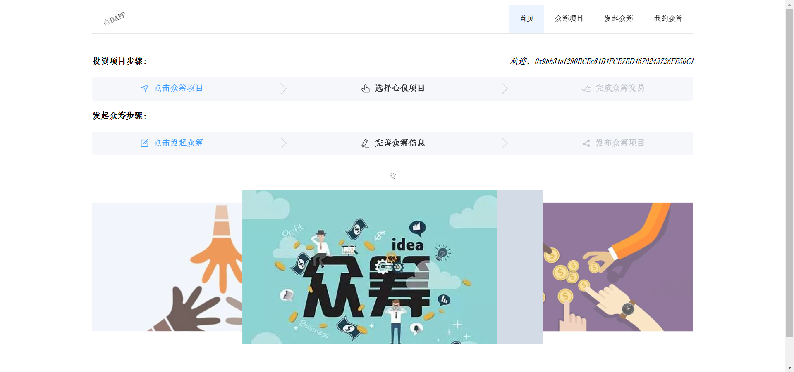
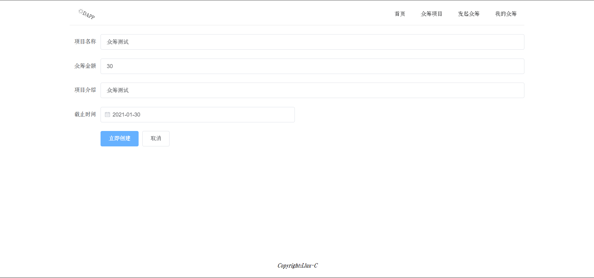
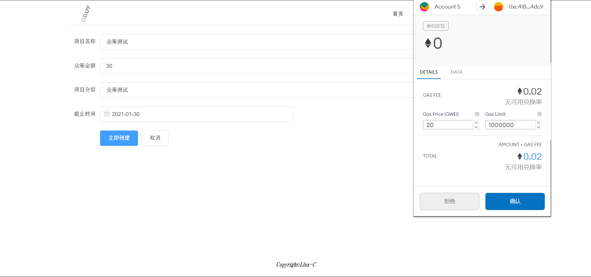
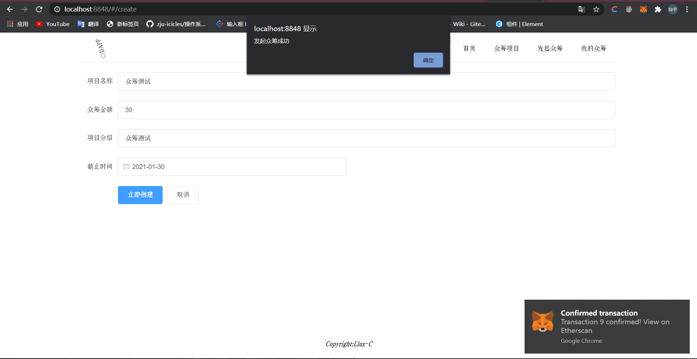
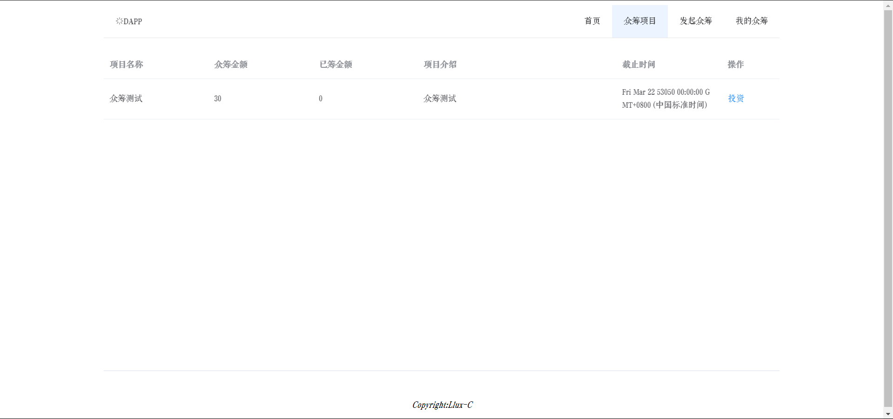
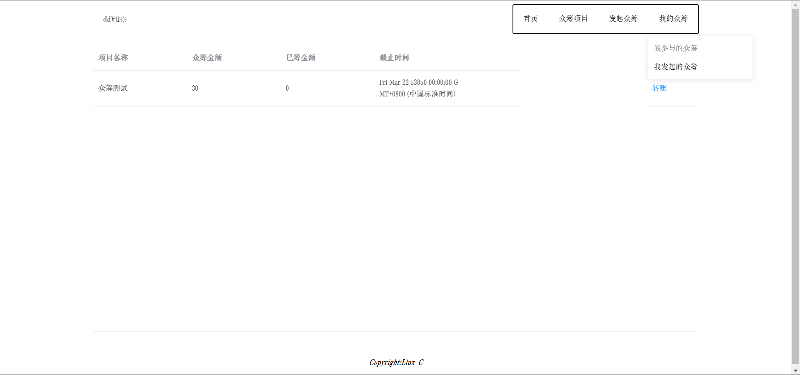

# dapp

###### 浙江大学区块链2020大作业

## 环境配置

+ ###### 用vscode进行开发

+ ###### 安装node.js、npm、yarn

  + node.js、npm自行百度

  + yarn安装：

    `npm i -g yarn`

    `yarn --version`检验

+ ###### 安装solc

  + `npm install solc -g`
  + `solcjs --version`

+ ###### 安装truffle

  + `npm install truffle -g`
  + `truffle version`

+ ###### 安装web3

  + `yarn add web3 -S`

+ ###### 在Chrome浏览器上安装MetaMask插件（小狐狸）

+ ###### 下载Ganache

  > https://www.trufflesuite.com/ganache

+ ###### 配置Ganache端口

  + 打开Ganache软件，在ganache软件上选择 quickstart，单击右上角齿轮图标进行设置。
  +  在 workspace 标签页中 add project 选中` ./truffle-config.js`
  + 在server标签卡中将端口改为8545。
  + 单击右上角 save and restart。

+ ###### 编译合约

  + 在`dapp`文件夹里运行powershell，输入`truffle migrations`
  + 会生成一个`build/contract/CrowdFunding.json`文件，代表已经成功

+ ###### 替换智能合约地址

  + 编译后打开Ganache软件，点击BLOCKS
  + 进入后点击进入一个TRANSACTION，复制其CREATED CONTRACT ADDRESS值
  + 将该值复制到`./src/views/Global.vue`文件第九行引号内

+ ###### 运行代码

  + 第一次
    + 在dapp文件夹下powershell输入`vue ui`，进入vue-cli UI界面
    + 导入整个dapp文件夹，在插件中选择添加`router`、`element`
    + 在任务中选择serve开始运行
  + 配置完插件后
    + 直接在dapp文件夹powershell输入`npm run serve`即可

+ ###### Metamask导入账户

  + 在Chrome中打开metamask，右上角My Accounts导入账户
  + 在Ganache客户端，ACCOUNTS界面一共有10各账户，点击右边的钥匙标志，私钥复制导入
  + MetaMask测试网络选择`Localhost 8545`

+ ###### 配置完成，可以开始体验众筹DAPP

  + 可以在metamask中导入多个账户，切换账户进行测试

## 界面截图

+ 主页面

   

+ 发起众筹

   

   

    

+ 众筹项目

   

+ 我的众筹

   

## 注意：

+ 本DAPP在金额设置仍有缺陷，没有转化为ether
+ 本DAPP在时间设置仍有缺陷，时间戳和实际时间的转换还有bug
+ 本DAPP每个众筹项目只能发起一次转账，一次失败后众筹项目终止
+ 本DAPP在投资方面设置仍有缺陷，每次投资一律只投10块钱

